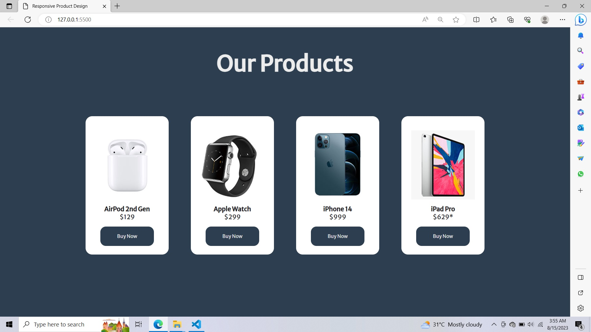

# ITR-project
Responsive product card design using HTML and CSS

A responsive product card is a UI component that displays information about a product in a visually appealing way. 
It is designed to be responsive, meaning that it can adapt to different screen sizes and devices.
A responsive product card typically includes an image of the product, a title, a description, and a price. 
It may also include additional information such as customer reviews or ratings.

